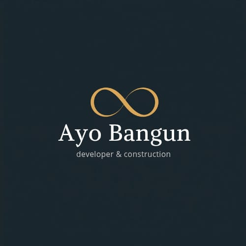

<!doctype html>
<html lang="id">
<head>
<meta charset="UTF-8"><meta name="viewport" content="width=device-width,initial-scale=1">
<title>AyoBangun Contractor</title>
<link rel="manifest" href="manifest.json"><link rel="stylesheet" href="styles.css">
</head>
<body>
<header>
<h1>AyoBangun Contractor</h1>
Construction Project Management

</header>
<main>
<section class="grid">

<h3>Dashboard Proyek</h3>
0 Proyek Aktif

<h3>Material Kritis</h3>
Belum ada data

<h3>Tenaga Hari Ini</h3>
0 Orang

<h3>Progress</h3>
0%

</section>
<section class="card"><h2>Menu Utama</h2>
<button onclick="addProject()">+ Project</button>
<button onclick="addMaterial()">Material Masuk/Keluar</button>
<button onclick="addAttendance()">Absensi Tukang</button>
<button onclick="reportWA()">Laporan WhatsApp</button>
</section>
<section class="card"><h2>Catatan Proyek</h2><textarea id="notes" placeholder="Kendala lapangan, target, pekerjaan harian"></textarea></section>
</main>
<nav>Dashboard | Project | Material | Pekerja | Laporan | Admin</nav>

</body></html>
